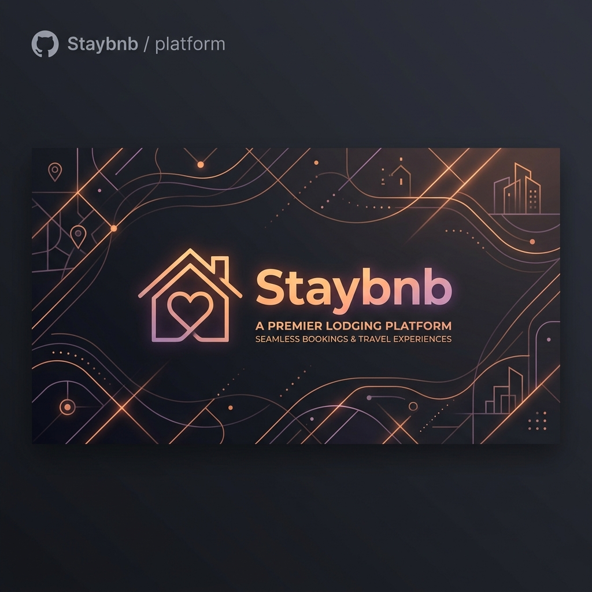
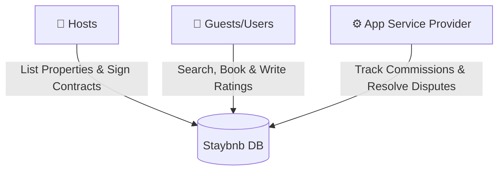
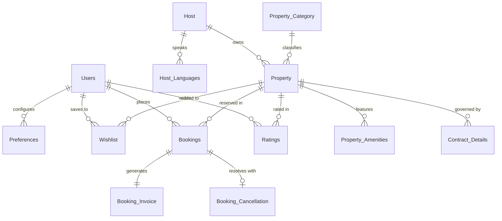

<p align="center">
  
</p>

<h1 align="center">🏨 Staybnb Rental Services</h1>

<p align="center">
  <b>A robust, fully normalized PostgreSQL Database Management System designed to power an online lodging platform similar to Airbnb.</b>
</p>

<p align="center">
  <a href="https://www.postgresql.org/"></a>
  <a href="#"></a>
  <a href="#"></a>
  <a href="#"></a>
</p>

---

## 👥 Meet The Team

<div align="center">
  <table>
    <tr>
      <td align="center" width="25%">
        <br />
        <br /><b>Om Patel</b><br />
      </td>
      <td align="center" width="25%">
        <br />
        <br /><b>Shyam Ramani</b><br />
      </td>
      <td align="center" width="25%">
        <br />
        <br /><b>Ramit Sherashiya</b><br />
      </td>
      <td align="center" width="25%">
        <br />
        <br /><b>Rahi Narodia</b><br />
      </td>
    </tr>
  </table>
</div>

---

## 🌟 System Highlights

* 🔒 **Data Integrity:** Fully integrated with `ON DELETE CASCADE` and `ON UPDATE CASCADE` constraints to guarantee clean data workflows.
* ⚡ **3NF Normalization:** Zero transitive dependencies across hosts, property categories, locations, and multi-lingual options.
* 📈 **Business Intelligence:** Leverages 26 advanced SQL queries monitoring net occupancy rates, dynamic refund validations, and location-proximity metrics.

> [!IMPORTANT]
> This repository houses the database implementation and DDL structure for **Staybnb**. The database schema is fully customized to track properties, bookings, ratings, contract details, and refunds seamlessly.

---

## 🎯 Stakeholder Use Cases



* **Hosts:** Can list properties, specify individual rules (pet limits, check-in schedules, cancellations), sign rental contracts, and track net payouts.
* **Guests:** Can filter properties by preference constraints (WiFi, pool, price range, city), manage bookings, create wishlists, pay invoices, and review stays.
* **Service Provider:** Enforces commissions/monthly rents, issues booking cancellations, and draws statistical charts (popular destinations, revenue metrics).

---

## 📐 Database Schema & Architecture

The database structure features **13 tables** organized to model Airbnb-like workflows.

### ER Relationship Model



<details>
<summary><b>📖 Click to Expand Database Table Dictionary</b></summary>

| Table Name | Description | Key Attributes |
| :--- | :--- | :--- |
| `Users` | User profiles containing contact info, addresses, credentials, and Government IDs. | `User_ID` (PK) |
| `Preferences` | Guest search preferences (amenities, property type, preferred city). | `Pref_ID` (PK), `User_ID` (FK) |
| `Host` | Profiles of property hosts, including ratings, response rates, and superhost status. | `Host_ID` (PK) |
| `Host_Languages` | Multivalued attribute storing all languages spoken by the host. | `Host_ID` (FK), `Languages_Spoken` (PK) |
| `Property_Category` | Categories of properties (e.g., Villa, Apartment, Cottage, Treehouse, Houseboat). | `Category_ID` (PK) |
| `Property` | Property listings, prices, rules, accommodations, and geolocation details. | `Property_ID` (PK), `Host_ID` (FK), `Category_ID` (FK) |
| `Property_Amenities` | Multi-valued amenities offered by a property (e.g., WiFi, Pool, Desert Safari, BBQ). | `Property_ID` (FK), `Amenity_Name` (PK) |
| `Ratings` | Review comments and ratings score given by guests to properties. | `User_ID` (FK), `Property_ID` (FK) |
| `Wishlist` | Guest bookmarks for properties they are interested in. | `User_ID` (FK), `Property_ID` (FK) |
| `Bookings` | Guest reservations detailing timeline, check-in, check-out, and confirmation status. | `Booking_ID` (PK), `User_ID` (FK), `Property_ID` (FK) |
| `Booking_Invoice` | Invoices containing payment status, transaction codes, and billing amounts. | `Invoice_ID` (PK), `Booking_ID` (FK) |
| `Booking_Cancellation` | Log of cancelled bookings, reasons, refund amounts, and status. | `Cancellation_ID` (PK), `Booking_ID` (FK) |
| `Contract_Details` | Platform agreements defining monthly fees or commission rates per booking. | `Contract_ID` (PK), `Property_ID` (FK) |

</details>

---

## 💾 Project Repository Structure

```text
├── DDL_Script.txt           # SQL setup commands (duplicate text file)
├── ER_Relational_Normal.pdf # Conceptual ER diagram & Normalization justification details
├── Project_Description.docx # Word document specifying scope & project instructions
├── SQL Queries.txt          # Postgres SQL commands for all 26 custom analytical questions
├── ddl_airbnb.sql           # Database schema definition script
├── queries with photo.pdf   # Visual screenshots of query command outputs
├── readme.md                # Beautiful GitHub documentation README file
├── staybnb_banner.png       # Sleek project header banner
└── sample_data.txt          # Seed script populating user records, bookings, and payments
```

---

## ⚡ Setup & Execution Guide

### Steps to Initialize DBMS
1. **Initialize the Schema:**
   Use your terminal to setup the schema structure inside PostgreSQL:
   ```bash
   psql -U postgres -d your_database_name -f ddl_airbnb.sql
   ```
2. **Seed Mock Datasets:**
   Load the mock values (Users, Properties, Invoices, and Bookings) into the database:
   ```bash
   psql -U postgres -d your_database_name -f sample_data.txt
   ```
3. **Run Query Scripts:**
   Execute queries inside Postgres command line or tools like pgAdmin 4:
   ```bash
   psql -U postgres -d your_database_name -f "SQL Queries.txt"
   ```

---

## 📊 Analytical Query Showcases

### 1. Net Host Earnings (Revenue minus Refunded Cancellations)
Calculates host revenue from invoices and subtracts the refund amounts of approved cancellations.
```sql
WITH earnings AS (
    SELECT h.Host_ID, SUM(inv.Amount) AS BookingsEarnings
    FROM Host AS h
    INNER JOIN Property AS p ON p.Host_ID = h.Host_ID
    INNER JOIN Bookings AS b ON b.Property_ID = p.Property_ID
    INNER JOIN Booking_Invoice AS inv ON b.Booking_ID = inv.Booking_ID
    GROUP BY h.Host_ID
),
refund AS (
    SELECT h.Host_ID, SUM(can.Refund_Amount) AS Cancellation_Refund
    FROM Host AS h
    INNER JOIN Property AS p ON p.Host_ID = h.Host_ID
    INNER JOIN Bookings AS b ON b.Property_ID = p.Property_ID
    INNER JOIN Booking_Invoice AS inv ON b.Booking_ID = inv.Booking_ID
    INNER JOIN Booking_Cancellation AS can ON inv.Booking_ID = b.Booking_ID
    WHERE can.Refund_Status = 'Refunded'
    GROUP BY h.Host_ID
)
SELECT e.Host_ID, e.BookingsEarnings - COALESCE(r.Cancellation_Refund, 0) AS Net_Earnings
FROM earnings AS e
LEFT JOIN refund AS r ON e.Host_ID = r.Host_ID;
```

### 2. Category Booking Volumes
Queries which lodging categories are most booked by guests:
```sql
SELECT pc.Category_ID, pc.Category_Name, COUNT(b.Booking_ID) AS Booking_Count
FROM Property_Category AS pc
INNER JOIN Property AS p ON pc.Category_ID = p.Category_ID
INNER JOIN Bookings AS b ON p.Property_ID = b.Property_ID
GROUP BY pc.Category_ID, pc.Category_Name
ORDER BY Booking_Count DESC;
```

> [!TIP]
> Make sure your PostgreSQL server connection path matches the search path variable configured in the SQL files (`SET search_path TO staybnb;`).
 make some changes not full make dif logos
